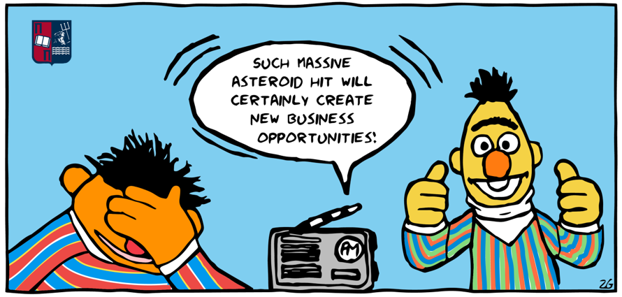

# Topic Modelling and a Fine-Tuned BERT-Based Transfer Learning Approach for Sentiment Classification of Financial News Feed 

This is a repository for my bachelor's thesis - Topic Modelling and a Fine-Tuned BERT-Based Transfer Learning Approach for Sentiment Classification of Financial News Feed - as part of the B.Sc. in Digital Systems at University of Piraeus. 

  

## Abstract 
Developing Artificial Intelligence agents that would learn from different tasks and accumulate this knowledge over time to perform successfully in a new task is an area of research that is still being explored. In this work, we will lay out a pipeline that allows a Machine Learning-based system to learn from $k$ different domains and then performs inference in a downstream fashion on new tasks using minimal or even no data uses some or no data from the new task for the system to perform strongly on that new task. To examinate our approach, we chose an AI task that falls under the Natural Language Processing domain and that is sentiment analysis. The idea of this thesis was to combine sentiment classifiers trained on different source domains and test them on a new domain. To this end, we created a dataset with extracted tweets that had been posted from different CEOs, in order to perform topic modelling, in our case  we use Michael Dell, CEO and Founder of Dell Inc. We test three algorithms for topic modeling: LDA, LSI, and LDA with Bigrams. Our ultimate goal is to extract relevant topics from Michael Dell's tweets and group them into specific clusters focusing on business-related tweets. In parallel, we constructed a dataset with tweets about Dell Inc. that have been posted on Twitter by different users. After that, we initially used an open-source dataset from Kaggle, that contains financial news, to fine-tune various pre-trained language models for sentiment classification in this specific field of business/financial news. We use BERT-based models such as vanilla BERT and RoBERTa. Following the fine-tuning procedure, we select the model with the best evaluation score among the two and use it to annotate labels on both datasets that we have created. The final goal is to extract meaningful information about Dell's users' sentiment and compare it to the overall sentiment which includes CEO tweets.

## Research Problem
Nowadays, vast amount of people opinion on different topics is openly available in online platforms such as twitter. Such data could help various enterprises to optimize their processes to offer better services and eventually increase their profits. For instance, in the financial sector, investors are constantly aware of the behavior of stock markets. This affects their emotions and motivates them to buy or sell shares. Financial sentiment analysis allows us to understand the effect of social media reactions and emotions on the stock market and vice versa. Individual investors used to rely heavily on investment bank financial advisors some decades ago. Big data allows the general population to have access to vast amounts of data containing useful information. As a result, the emotion expressed on social media plays a critical role in their research. 

Big data's impact on the emergence of financial texts has presented challenges for most organizations and increased need for analytical tools. Text streams are typically more difficult to manage than numeric data streams. Despite their natural lack of order, text streams reflect collective expressions that are valuable in making any financial choice. Making sense of unstructured textual material can be difficult but also vital. 

The focus of our thesis is the application of pre-trained language models on financial text classification with the combination of topic modelling techniques. The relationship between sentiment derived from the social media platform Twitter and financial markets is examined in this dissertation. We examine important issues connected to the surge in interest in unstructured data insight extraction and how to assess if such insight offers any clues about the patterns of financial markets. One of the topics it seeks to address is whether or whether sentiment gleaned from social media can be used to predict future values of financial assets.

## Organization of the Repository

The `Topic_Modelling` directory contains three sub-directories: `01_CEOs_Tweets_Scraping`, `02_Preprocessing_CEO_Tweets`, and `03_Applying_Topic_Modeling`. These contain the code for the three workflows. In each subdirectory:

* `01_CEOs_Tweets_Scraping` contains the source code `CEOs_Tweets_Scraping.ipynb` that extracts tweets about diffferent CEOs and create the first dataset. 
* `02_Preprocessing_CEO_Tweets` contains the source code `CEO_Preprocessing.ipynb` that defines the preprocessing process in order to clean the tweets and make a dataset about Michael Dell, Chairman and CEO of DELL Technology Company;
* `03_Applying_Topic_Modeling` contains the source code `CEO_Applying_Topic_Modelling.ipynb` that defines the implementantion and experimantation of topic modelling.

In parallel the `Sentiment_Analysis` directory contains five sub-directories: `01_Dataset_From_Kaggle`, `02_Financial_News_Preprocessing`, and `03_Scraping_tweets_for_Dell_Company`, `04_Tweets_Preprocessing_for_Dell_Company` and `05_Fine_Tuning_and_Insights_Extraction` . These contain the code for the five workflows. In each subdirectory:

* `01_Dataset_From_Kaggle` containts the `data.csv` that is an open source dataset from Kaggle and we used it in order to implement fine-tuning in financial news.
* `02_Financial_News_Preprocessing` containts the source code `Financial_News_Preprocessing.ipynb` that defines the preprocessing process in order to clean the financial news from Kaggle.
* `03_Scraping_tweets_for_Dell_Company` containts the source code `Tweets_Scraping_For_Dell_Company.ipynb` that extracts tweets about DELL Inc. and create the third dataset. 
* `04_Tweets_Preprocessing_for_Dell_Company` containts the source code `Tweets_Preprocessing_For_Dell_Company.ipynb` that defines the preprocessing process in order to clean the tweets.
* `05_Fine_Tuning_and_Insights_Extraction` contains the source code `Sentiment_Analysis_with_BERT_Based_Fine_Tuned_Models.ipynb` that defines the implementantion and experimantation of fine-tuning, sentiment analysis, and insights extraction.

